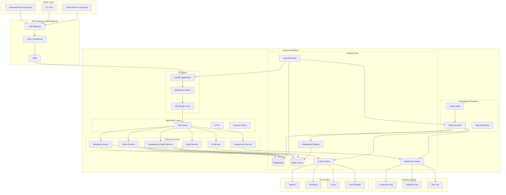
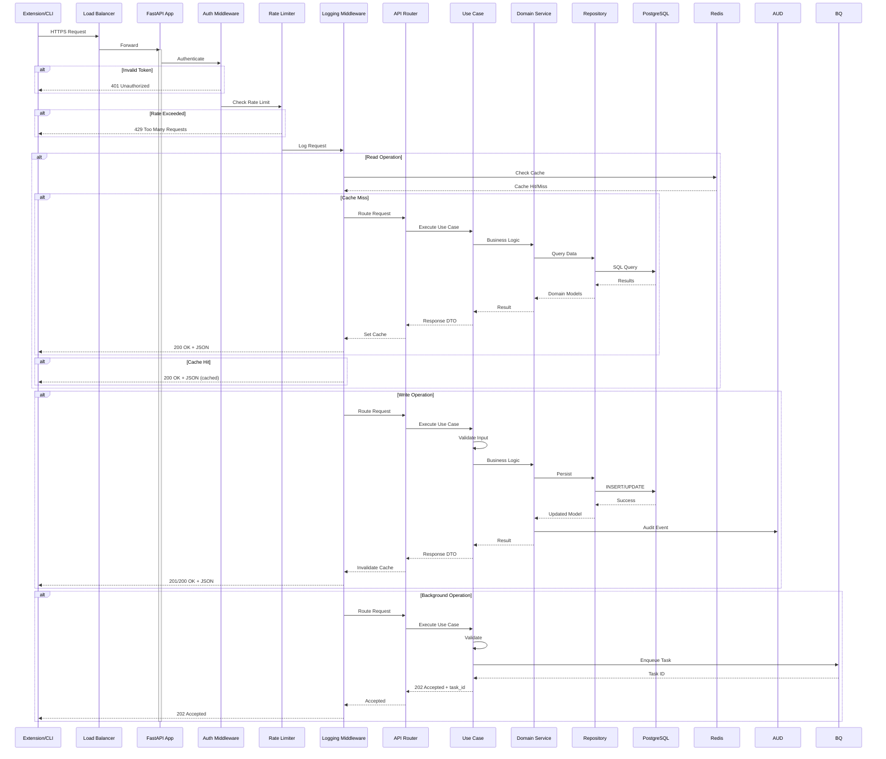
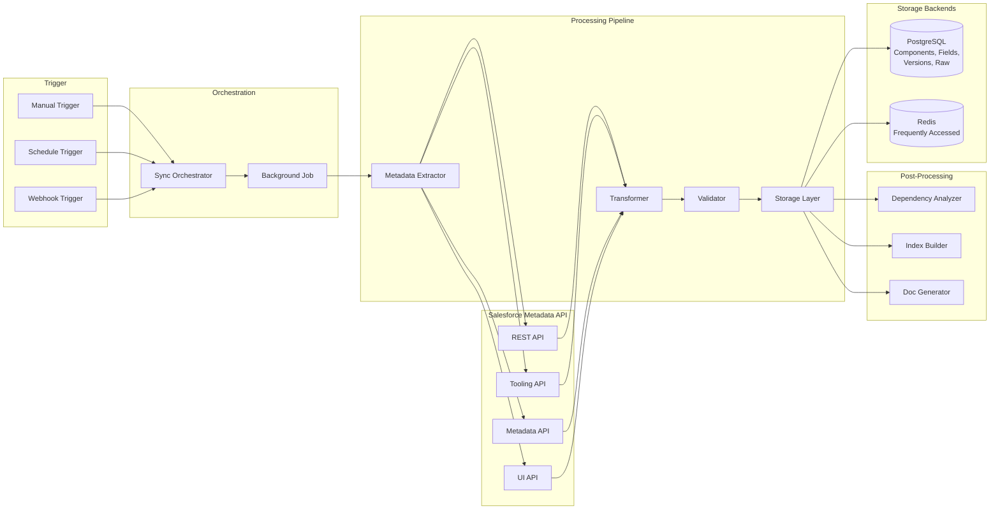
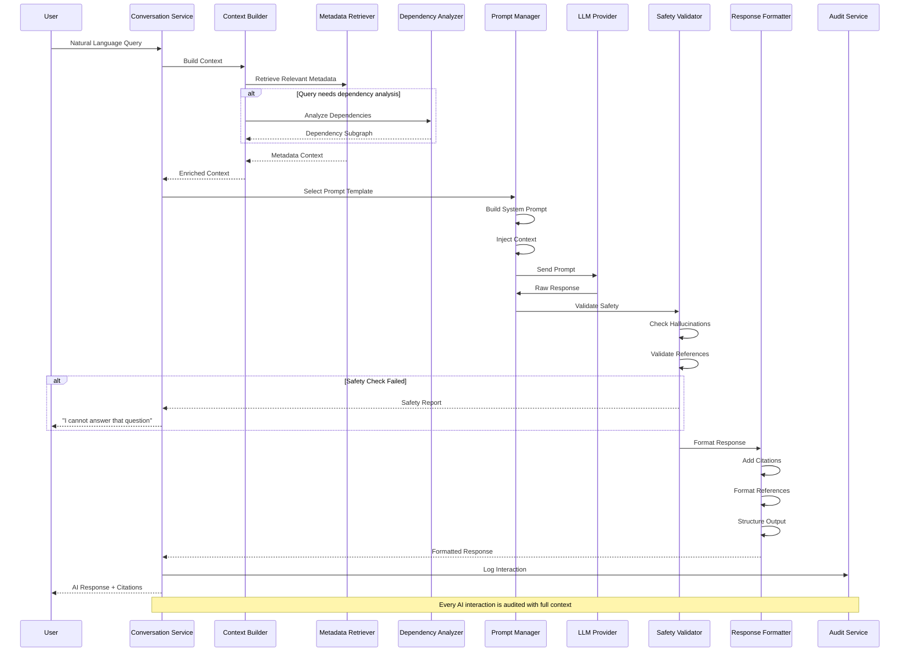
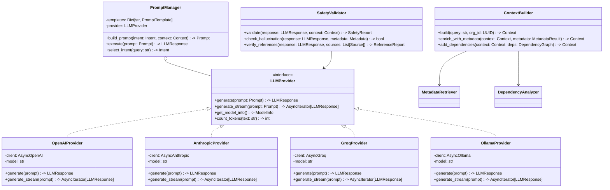
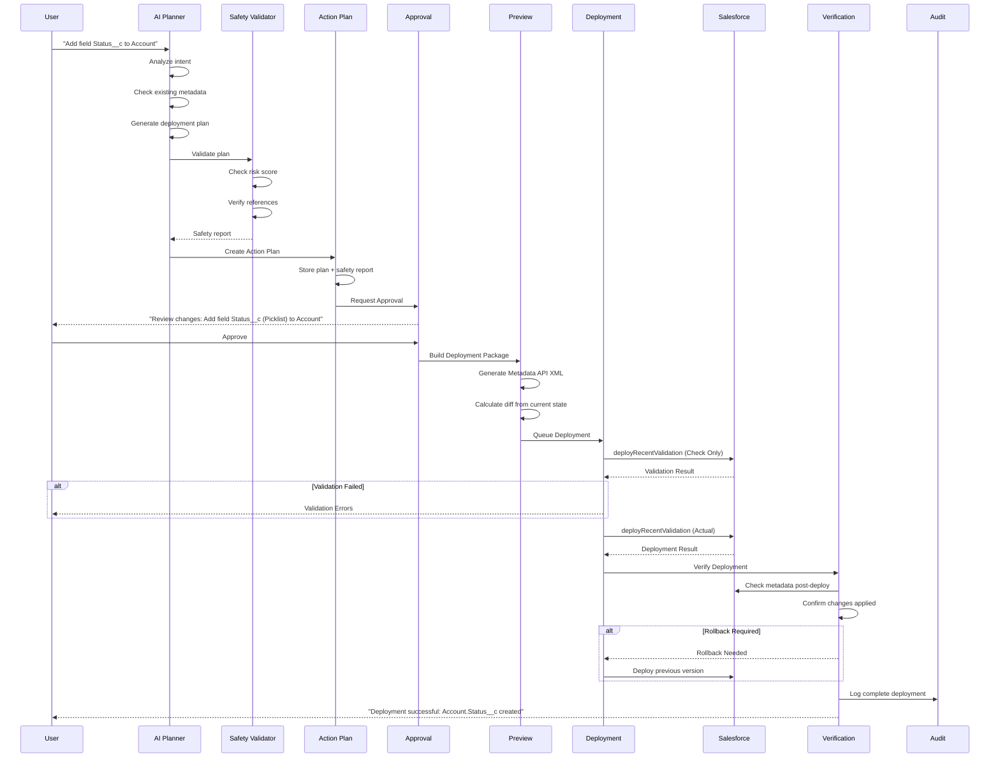
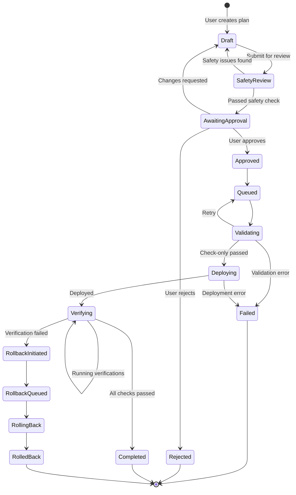
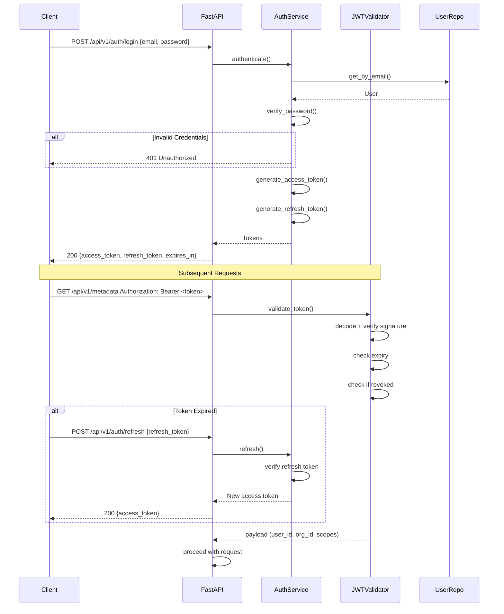
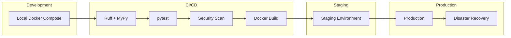

# Phase 1: Architecture Design

## Salesforce Inspector Reloaded — AI-Powered Backend

---

## 1. Architecture Philosophy

The backend follows **Clean Architecture** (hexagonal) with strict separation of concerns:

```
┌──────────────────────────────────────────────────────────────┐
│                     API Layer (FastAPI)                       │
│  Routes, Middleware, Request/Response Schemas, Dependencies   │
├──────────────────────────────────────────────────────────────┤
│                  Application Layer (Use Cases)                 │
│  Orchestrates domain services, DTOs, transaction management   │
├──────────────────────────────────────────────────────────────┤
│                    Domain Layer (Entities)                     │
│  Business logic, domain events, policies, value objects       │
├──────────────────────────────────────────────────────────────┤
│                   Service Layer (Services)                     │
│  Metadata, AI, Dependency Graph, Deployment, Audit, Auth      │
├──────────────────────────────────────────────────────────────┤
│                Infrastructure Layer (Persistence)              │
│  DB models, repositories, Salesforce clients, LLM providers   │
│  Cache, Queue, Observability, Security                        │
└──────────────────────────────────────────────────────────────┘
```

### Key Design Decisions

| Decision | Choice | Rationale |
|----------|--------|-----------|
| **Language** | Python 3.12+ | Existing backend is Python; rich AI/ML ecosystem; async support |
| **Web Framework** | FastAPI | Native async, Pydantic v2, OpenAPI generation, dependency injection |
| **ORM** | SQLAlchemy 2.x (async) | Mature, well-tested, async support with asyncpg |
| **Database** | PostgreSQL | JSONB for flexible metadata, UUID support, full-text search, excellent with SQLAlchemy |
| **Cache** | Redis | Session cache, metadata cache, rate limiting, Celery broker |
| **Background Worker** | Celery + Redis | Battle-tested, task queues, scheduling, retries, progress tracking |
| **AI Provider** | Interface-based (pluggable) | OpenAI, Anthropic, Groq, or local models via protocol adapters |
| **Auth** | JWT + OAuth 2.0 + API Keys | Stateless auth for APIs, OAuth for Salesforce, API keys for service accounts |
| **Observability** | OpenTelemetry | Vendor-neutral, traces + metrics + logs correlation |
| **Config** | Pydantic Settings | Type-safe, env-based, secrets management |
| **Testing** | pytest + httpx + testcontainers | Async testing, isolated DB per test, Salesforce mocks |

---

## 2. Overall Architecture



---

## 3. Request Flow



---

## 4. Metadata Processing Pipeline



### Metadata Sync Strategy

| Phase | What Happens | API Used |
|-------|-------------|----------|
| 1 | Org identity, limits, API version | REST API (`/limits`, `/versions`) |
| 2 | Standard & Custom Objects + Fields | REST API (`/sobjects/`) |
| 3 | Relationships between objects | Tooling API (`EntityDefinition`, `FieldDefinition`) |
| 4 | Apex Classes, Triggers | Tooling API (`ApexClass`, `ApexTrigger`) |
| 5 | Flows, Process Builders | Tooling API (`Flow`, `FlowDefinitionView`) |
| 6 | Validation Rules | Tooling API (`ValidationRule`) |
| 7 | Profiles, Permission Sets | Metadata API (`Profile`, `PermissionSet`) |
| 8 | Custom Metadata, Custom Settings | REST API + Tooling API |
| 9 | Layouts, Lightning Pages | Tooling API (`Layout`, `FlexiPage`) |
| 10 | Quick Actions, Global Actions | Tooling API (`QuickActionDefinition`) |
| 11 | Formula Fields (parse & index) | Tooling API + custom parser |
| 12 | Dependency graph construction | Internal computation |

---

## 5. AI Agent Flow



### AI Provider Abstraction



---

## 6. Deployment Pipeline



### Deployment State Machine



---

## 7. Database Relationships

```mermaid
erDiagram
    %% Organization Management
    Organization {
        uuid id PK
        string name
        string slug UK
        string salesforce_org_id UK
        string instance_url
        string environment
        string status
        jsonb settings
        datetime created_at
        datetime updated_at
    }

    User {
        uuid id PK
        string email UK
        string display_name
        string password_hash
        string external_subject UK
        bool is_active
        bool is_service_account
        datetime last_login_at
        datetime created_at
        datetime updated_at
    }

    OrganizationMembership {
        uuid organization_id FK
        uuid user_id FK
        string status
        uuid invited_by_user_id FK
        datetime accepted_at
        text notes
    }

    Role {
        uuid id PK
        string name UK
        string description
        bool is_system
    }

    Permission {
        uuid id PK
        string code UK
        string description
    }

    RolePermission {
        uuid role_id FK
        uuid permission_id FK
    }

    UserRole {
        uuid user_id FK
        uuid organization_id FK
        uuid role_id FK
    }

    ApiKey {
        uuid id PK
        uuid user_id FK
        uuid organization_id FK
        string name
        string key_prefix
        string key_hash UK
        jsonb scopes
        datetime expires_at
        datetime revoked_at
        datetime last_used_at
    }

    %% Salesforce Integration
    SalesforceConnection {
        uuid id PK
        uuid organization_id FK
        uuid connected_by_user_id FK
        string connection_type
        string salesforce_org_id
        string instance_url
        string login_url
        string api_version
        string status
        jsonb scopes
        text access_token_encrypted
        text refresh_token_encrypted
        datetime token_expires_at
        datetime last_refreshed_at
        datetime revoked_at
    }

    SalesforceApiUsage {
        uuid id PK
        uuid organization_id FK
        string api_family
        string endpoint
        string method
        int status_code
        int duration_ms
        string request_id
        int rate_limit_remaining
        datetime window_started_at
        text error_message
    }

    %% Metadata
    MetadataSyncRun {
        uuid id PK
        uuid organization_id FK
        uuid requested_by_user_id FK
        string status
        string sync_type
        string api_version
        datetime started_at
        datetime completed_at
        text error_message
        jsonb stats
    }

    MetadataComponent {
        uuid id PK
        uuid organization_id FK
        uuid parent_component_id FK
        string component_type
        string api_name
        string full_name
        string label
        string namespace_prefix
        string salesforce_id
        string durable_id
        string checksum
        string api_version
        string status
        jsonb extra
        datetime last_seen_at
        datetime indexed_at
    }

    MetadataField {
        uuid id PK
        uuid organization_id FK
        uuid component_id FK
        string api_name
        string label
        string data_type
        string relationship_name
        jsonb reference_to
        bool is_custom
        bool is_formula
        bool is_required
        bool is_unique
        bool is_external_id
        text formula
        text inline_help_text
        jsonb extra
    }

    MetadataVersion {
        uuid id PK
        uuid component_id FK
        uuid sync_run_id FK
        string version_label
        string checksum
        jsonb payload
    }

    MetadataRawPayload {
        uuid id PK
        uuid component_id FK
        uuid sync_run_id FK
        string source_api
        string payload_hash
        jsonb payload
    }

    %% Dependency Graph
    DependencyEdge {
        uuid id PK
        uuid organization_id FK
        uuid source_component_id FK
        uuid target_component_id FK
        string edge_type
        string source_key
        string target_key
        int confidence
        string risk_level
        string source_api
        jsonb evidence
        text notes
        datetime last_verified_at
    }

    DependencySnapshot {
        uuid id PK
        uuid organization_id FK
        uuid root_component_id FK
        string root_key
        string traversal_direction
        int max_depth
        string graph_hash
        jsonb payload
        datetime generated_at
    }

    %% AI
    AiConversation {
        uuid id PK
        uuid organization_id FK
        uuid created_by_user_id FK
        string title
        string status
        jsonb metadata_scope
    }

    AiMessage {
        uuid id PK
        uuid conversation_id FK
        string role
        text content
        jsonb citations
        string safety_status
        int token_count
    }

    PromptHistory {
        uuid id PK
        uuid organization_id FK
        uuid ai_message_id FK
        string template_name
        string template_version
        string llm_provider
        string model_name
        string prompt_hash
        int input_tokens
        int output_tokens
        int latency_ms
        jsonb prompt_payload
        jsonb response_payload
    }

    RetrievalContext {
        uuid id PK
        uuid ai_message_id FK
        uuid organization_id FK
        string retrieval_strategy
        jsonb component_ids
        jsonb query_payload
        jsonb context_payload
    }

    %% Action System
    ActionPlan {
        uuid id PK
        uuid organization_id FK
        uuid requested_by_user_id FK
        uuid conversation_id FK
        string title
        string status
        int risk_score
        string risk_level
        text summary
        jsonb plan_payload
        jsonb safety_report
        jsonb rollback_plan
    }

    ActionStep {
        uuid id PK
        uuid action_plan_id FK
        int step_order
        string operation
        string target_type
        string target_full_name
        string status
        jsonb diff_payload
        jsonb validation_payload
    }

    Approval {
        uuid id PK
        uuid action_plan_id FK
        uuid requested_by_user_id FK
        uuid decided_by_user_id FK
        string status
        text decision_reason
        datetime decided_at
    }

    Deployment {
        uuid id PK
        uuid organization_id FK
        uuid action_plan_id FK
        uuid requested_by_user_id FK
        string salesforce_deploy_id
        string status
        bool check_only
        datetime started_at
        datetime completed_at
        jsonb result_payload
        text error_message
    }

    DeploymentArtifact {
        uuid id PK
        uuid deployment_id FK
        string artifact_kind
        string storage_uri
        string checksum
        jsonb payload
    }

    DeploymentVerification {
        uuid id PK
        uuid deployment_id FK
        string verification_type
        string status
        jsonb details
    }

    %% Background Jobs
    BackgroundJob {
        uuid id PK
        uuid organization_id FK
        uuid requested_by_user_id FK
        string job_type
        string status
        string celery_task_id UK
        int progress_current
        int progress_total
        jsonb payload
        jsonb result
        text error_message
        datetime started_at
        datetime completed_at
        datetime cancelled_at
    }

    JobEvent {
        uuid id PK
        uuid job_id FK
        string event_type
        text message
        jsonb payload
    }

    JobCancellation {
        uuid id PK
        uuid job_id FK
        uuid requested_by_user_id FK
        text reason
        datetime acknowledged_at
    }

    %% Audit
    AuditLog {
        uuid id PK
        uuid organization_id FK
        uuid actor_user_id FK
        string action
        string resource_type
        string resource_id
        string request_id
        string correlation_id
        inet ip_address
        string user_agent
        datetime occurred_at
        jsonb before_state
        jsonb after_state
        jsonb details
    }

    %% Relationships
    Organization ||--o{ OrganizationMembership: has
    User ||--o{ OrganizationMembership: has
    Organization ||--o{ UserRole: has
    User ||--o{ UserRole: has
    Role ||--o{ UserRole: has
    Role ||--o{ RolePermission: has
    Permission ||--o{ RolePermission: has
    User ||--o{ ApiKey: has
    Organization ||--o{ ApiKey: scoped_to
    
    Organization ||--o{ SalesforceConnection: configured
    Organization ||--o{ SalesforceApiUsage: tracked
    
    Organization ||--o{ MetadataSyncRun: initiated
    Organization ||--o{ MetadataComponent: contains
    MetadataComponent ||--o{ MetadataField: has
    MetadataComponent ||--o{ MetadataVersion: versioned
    MetadataComponent ||--o{ MetadataRawPayload: raw_data
    MetadataComponent ||--o{ MetadataComponent: parent_child
    MetadataSyncRun ||--o{ MetadataVersion: produced_by
    MetadataSyncRun ||--o{ MetadataRawPayload: produced_by
    
    Organization ||--o{ DependencyEdge: defines
    Organization ||--o{ DependencySnapshot: cached
    MetadataComponent ||--o{ DependencyEdge: source
    MetadataComponent ||--o{ DependencyEdge: target
    
    Organization ||--o{ AiConversation: has
    User ||--o{ AiConversation: created
    AiConversation ||--o{ AiMessage: contains
    AiMessage ||--o{ PromptHistory: logged
    AiMessage ||--o{ RetrievalContext: sourced
    
    Organization ||--o{ ActionPlan: planned
    User ||--o{ ActionPlan: requested
    ActionPlan ||--o{ ActionStep: steps
    ActionPlan ||--o{ Approval: approvals
    ActionPlan ||--o{ Deployment: deployments
    Deployment ||--o{ DeploymentArtifact: artifacts
    Deployment ||--o{ DeploymentVerification: verifications
    
    Organization ||--o{ BackgroundJob: queued
    BackgroundJob ||--o{ JobEvent: events
    BackgroundJob ||--o{ JobCancellation: cancellations
    
    Organization ||--o{ AuditLog: records
    User ||--o{ AuditLog: actor
```



---

## 8. Component Interaction & Data Flow

### 8.1 Module Dependency Graph

```
API Layer (v1, v2)
  ├── depends on: Application Layer (use cases)
  ├── depends on: Schemas (Pydantic)
  └── depends on: Infrastructure (Dependencies)

Application Layer
  ├── depends on: Domain Entities
  ├── depends on: Domain Events
  ├── depends on: Service Interfaces
  ├── depends on: Repository Interfaces
  └── depends on: DTOs

Domain Layer
  ├── depends on: Value Objects
  └── depends on: Domain Events (self)

Services Layer
  ├── depends on: Domain Entities
  ├── depends on: Repository Interfaces
  └── depends on: Infrastructure interfaces

Infrastructure Layer
  ├── depends on: Domain Entities
  ├── depends on: External SDKs (httpx, sqlalchemy, redis, etc.)
  └── depends on: Configuration
```

### 8.2 Strict Dependency Rule

Dependencies point **inward**. Nothing in the inner layers can know about the outer layers.

```
External → Infrastructure → Services → Application → Domain
                                                       ↑
                                    (all arrows point inward)
```

---

## 9. Security Architecture

### 9.1 Authentication Flow



### 9.2 Authorization (RBAC)

| Permission | Code | Description |
|-----------|------|-------------|
| Metadata Read | `metadata:read` | View metadata components |
| Metadata Write | `metadata:write` | Modify metadata (requires approval) |
| Metadata Deploy | `metadata:deploy` | Deploy to Salesforce |
| Dependency Read | `dependency:read` | View dependency graph |
| AI Query | `ai:query` | Ask AI questions |
| AI Action | `ai:action` | Request AI to plan actions |
| Org Admin | `org:admin` | Manage org settings |
| User Admin | `user:admin` | Manage users |
| Audit Read | `audit:read` | View audit logs |
| Job Manage | `job:manage` | Manage background jobs |
| API Key | `apikey:manage` | Create/manage API keys |

### 9.3 Data Encryption

```python
# At-rest encryption for sensitive fields
#     - Salesforce access tokens: AES-256-GCM with key rotation
#     - Salesforce refresh tokens: AES-256-GCM with key rotation
#     - User passwords: bcrypt (via passlib)
#     - API keys: SHA-256 hash (one-way)
#
# In-transit: TLS 1.3 (mandatory)
# Database: Transparent Data Encryption (TDE) in production
# Secrets: HashiCorp Vault or AWS Secrets Manager
```

---

## 10. API Design

### 10.1 Endpoint Structure

```
/api/v1/
├── auth/
│   ├── POST /login
│   ├── POST /refresh
│   ├── POST /logout
│   └── GET  /me
├── organizations/
│   ├── GET  /                    # List organizations
│   ├── POST /                    # Create organization
│   ├── GET  /{org_id}            # Get organization details
│   ├── PATCH /{org_id}           # Update organization
│   └── DELETE /{org_id}          # Archive organization
├── connections/
│   ├── POST /                    # Connect Salesforce org
│   ├── GET  /                    # List connections
│   ├── GET  /{conn_id}           # Connection details
│   ├── PATCH /{conn_id}          # Update connection
│   ├── DELETE /{conn_id}         # Revoke connection
│   ├── POST /{conn_id}/refresh   # Refresh OAuth token
│   └── POST /{conn_id}/test      # Test connection
├── metadata/
│   ├── GET  /                    # List metadata (filtered/paginated)
│   ├── GET  /sync-runs           # List sync runs
│   ├── POST /sync                # Trigger sync
│   ├── GET  /sync-runs/{run_id}  # Sync run status
│   ├── GET  /components/{id}     # Component details
│   ├── GET  /components/{id}/fields
│   ├── GET  /components/{id}/versions
│   ├── GET  /search              # Full-text search metadata
│   └── GET  /types               # List metadata types
├── dependencies/
│   ├── GET  /                    # Dependency graph queries
│   ├── POST /analyze             # Analyze component
│   └── GET  /snapshots/{id}      # Get cached snapshot
├── ai/
│   ├── POST /chat                # Send message to AI
│   ├── POST /conversations       # Create conversation
│   ├── GET  /conversations       # List conversations
│   ├── GET  /conversations/{id}  # Get conversation
│   ├── DELETE /conversations/{id}
│   ├── POST /analyze             # Analyze metadata
│   ├── POST /generate-docs       # Generate documentation
│   └── POST /impact-analysis     # Impact analysis
├── actions/
│   ├── POST /plan                # AI generates action plan
│   ├── GET  /plans               # List action plans
│   ├── GET  /plans/{id}          # Plan details
│   ├── POST /plans/{id}/submit   # Submit for approval
│   ├── POST /plans/{id}/approve  # Approve
│   ├── POST /plans/{id}/reject   # Reject
│   ├── POST /plans/{id}/deploy   # Deploy
│   └── GET  /plans/{id}/steps    # Steps with status
├── deployments/
│   ├── GET  /                    # List deployments
│   ├── GET  /{deploy_id}         # Deployment details
│   ├── GET  /{deploy_id}/artifacts
│   ├── GET  /{deploy_id}/verifications
│   └── POST /{deploy_id}/rollback
├── jobs/
│   ├── GET  /                    # List background jobs
│   ├── GET  /{job_id}            # Job status
│   ├── POST /{job_id}/cancel     # Cancel job
│   └── GET  /{job_id}/events     # Job events
├── audit/
│   ├── GET  /                    # Query audit logs
│   └── GET  /export              # Export audit logs
├── users/
│   ├── GET  /                    # List users
│   ├── POST /                    # Invite user
│   ├── GET  /{user_id}           # User details
│   ├── PATCH /{user_id}          # Update user
│   └── DELETE /{user_id}         # Remove user
├── roles/
│   ├── GET  /                    # List roles
│   ├── POST /                    # Create role
│   ├── PATCH /{role_id}          # Update role
│   └── DELETE /{role_id}         # Delete role
├── api-keys/
│   ├── GET  /                    # List API keys
│   ├── POST /                    # Create API key
│   └── DELETE /{key_id}          # Revoke API key
└── health/
    ├── GET  /live                # Liveness check
    ├── GET  /ready               # Readiness check
    └── GET  /metrics             # Prometheus metrics
```

### 10.2 Response Envelope

Every API response follows a consistent envelope:

```json
{
  "status": "success" | "error",
  "data": { ... },
  "error": {
    "code": "VALIDATION_ERROR",
    "message": "Human-readable message",
    "details": { ... }
  },
  "meta": {
    "request_id": "req_abc123",
    "timestamp": "2026-07-06T12:00:00Z",
    "page": 1,
    "page_size": 50,
    "total": 1234
  }
}
```

---

## 11. Background Job Architecture

### 11.1 Job Types

| Job Type | Description | Priority | Timeout |
|----------|-------------|----------|---------|
| `full_metadata_sync` | Full metadata sync | low | 3600s |
| `incremental_metadata_sync` | Incremental sync | medium | 600s |
| `dependency_graph_update` | Rebuild deps for component | medium | 300s |
| `full_dependency_graph_rebuild` | Rebuild entire graph | low | 1800s |
| `ai_documentation_generation` | Generate docs | low | 600s |
| `ai_impact_analysis` | Run impact analysis | medium | 300s |
| `ai_report_generation` | Generate reports | low | 1200s |
| `deployment_validate` | Validate deployment | high | 300s |
| `deployment_execute` | Execute deployment | high | 600s |
| `deployment_verify` | Verify deployment | high | 300s |
| `deployment_rollback` | Rollback deployment | high | 600s |

### 11.2 Retry Policy

```python
RETRY_POLICIES = {
    "full_metadata_sync": {
        "max_retries": 3,
        "retry_delay": 60,  # seconds
        "retry_backoff": 2.0,  # exponential
        "retry_on": [ConnectionError, TimeoutError, SalesforceRateLimitError],
    },
    "deployment_execute": {
        "max_retries": 2,
        "retry_delay": 30,
        "retry_backoff": 1.0,  # linear
        "retry_on": [ConnectionError, TimeoutError],
    },
    "default": {
        "max_retries": 3,
        "retry_delay": 30,
        "retry_backoff": 2.0,
        "retry_on": [ConnectionError, TimeoutError],
    }
}
```

---

## 12. Observability Architecture

### 12.1 Structured Logging

```json
{
  "timestamp": "2026-07-06T12:00:00.123Z",
  "level": "INFO",
  "logger": "sfir_backend.api.v1.metadata",
  "message": "Metadata sync completed",
  "request_id": "req_abc123",
  "correlation_id": "corr_xyz789",
  "user_id": "usr_001",
  "organization_id": "org_001",
  "duration_ms": 45200,
  "metadata": {
    "sync_run_id": "sync_001",
    "components_processed": 1523,
    "status": "success"
  },
  "trace_id": "trace_001",
  "span_id": "span_001"
}
```

### 12.2 Metrics (Prometheus)

| Metric | Type | Labels | Description |
|--------|------|--------|-------------|
| `http_requests_total` | Counter | method, endpoint, status | Total HTTP requests |
| `http_request_duration_seconds` | Histogram | method, endpoint | Request latency |
| `ai_requests_total` | Counter | provider, model, intent | AI requests |
| `ai_request_duration_seconds` | Histogram | provider, model | AI latency |
| `ai_tokens_total` | Counter | provider, model, direction | Token usage |
| `metadata_sync_duration_seconds` | Histogram | sync_type | Sync duration |
| `metadata_components_total` | Gauge | org, component_type | Component count |
| `dependency_edges_total` | Gauge | org | Edge count |
| `dependency_graph_build_duration` | Histogram | - | Graph build time |
| `sf_api_calls_total` | Counter | org, api_family, endpoint | Salesforce API calls |
| `sf_api_call_duration_seconds` | Histogram | api_family | Salesforce latency |
| `sf_rate_limit_remaining` | Gauge | org | Rate limit remaining |
| `jobs_total` | Counter | job_type, status | Background job counts |
| `jobs_duration_seconds` | Histogram | job_type | Job duration |
| `db_pool_size` | Gauge | - | DB connection pool size |
| `db_query_duration_seconds` | Histogram | operation | Query latency |
| `cache_hit_ratio` | Gauge | cache_name | Cache effectiveness |

### 12.3 Health Checks

```python
# GET /api/v1/health/live
# Response: 200 OK
# Simple check - process is alive

# GET /api/v1/health/ready
# Checks:
#   - Database connectivity
#   - Redis connectivity
#   - Celery worker presence (for background jobs)
#   - Each configured Salesforce connection health
# Response: 200 OK or 503 Service Unavailable

# GET /api/v1/health/metrics
# Prometheus metrics endpoint
```

---

## 13. Caching Strategy

| Cache Key Pattern | TTL | Invalidated By | Purpose |
|-------------------|-----|---------------|---------|
| `metadata:component:{org_id}:{id}` | 300s | Metadata sync | Component detail |
| `metadata:fields:{org_id}:{component_id}` | 300s | Metadata sync | Component fields |
| `metadata:search:{org_id}:{query}` | 60s | Metadata sync | Search results |
| `dependency:upstream:{org_id}:{component_key}` | 600s | Graph update | "What uses this?" |
| `dependency:downstream:{org_id}:{component_key}` | 600s | Graph update | "What does this use?" |
| `sf:limits:{org_id}` | 60s | Explicit refresh | API limits |
| `sf:session:{org_id}` | Session TTL | Token refresh | Salesforce session |
| `auth:token:{token_jti}` | Token TTL | Logout | JWT blacklist |
| `user:permissions:{user_id}:{org_id}` | 300s | Role change | Cached permissions |

---

## 14. Error Handling Strategy

```python
class ErrorCode:
    # 4xx Client Errors
    VALIDATION_ERROR = "VALIDATION_ERROR"
    UNAUTHORIZED = "UNAUTHORIZED"
    FORBIDDEN = "FORBIDDEN"
    NOT_FOUND = "NOT_FOUND"
    CONFLICT = "CONFLICT"
    RATE_LIMITED = "RATE_LIMITED"
    UNPROCESSABLE_ENTITY = "UNPROCESSABLE_ENTITY"
    
    # 5xx Server Errors
    INTERNAL_ERROR = "INTERNAL_ERROR"
    SERVICE_UNAVAILABLE = "SERVICE_UNAVAILABLE"
    DEPENDENCY_FAILURE = "DEPENDENCY_FAILURE"
    
    # Domain Errors
    SALESFORCE_ERROR = "SALESFORCE_ERROR"
    SALESFORCE_RATE_LIMIT = "SALESFORCE_RATE_LIMIT"
    SALESFORCE_AUTH_ERROR = "SALESFORCE_AUTH_ERROR"
    METADATA_NOT_FOUND = "METADATA_NOT_FOUND"
    DEPENDENCY_ANALYSIS_FAILED = "DEPENDENCY_ANALYSIS_FAILED"
    AI_PROVIDER_ERROR = "AI_PROVIDER_ERROR"
    AI_SAFETY_VIOLATION = "AI_SAFETY_VIOLATION"
    DEPLOYMENT_FAILED = "DEPLOYMENT_FAILED"
    DEPLOYMENT_VALIDATION_FAILED = "DEPLOYMENT_VALIDATION_FAILED"
    JOB_NOT_FOUND = "JOB_NOT_FOUND"
    JOB_CANCELLED = "JOB_CANCELLED"
```

---

## 15. Rate Limiting Strategy

| Scope | Limit | Window | Applied To |
|-------|-------|--------|------------|
| Global (per IP) | 1000 | 1 minute | All endpoints |
| Per User | 100 | 1 minute | AI endpoints |
| Per User | 500 | 1 minute | Metadata endpoints |
| Per User | 50 | 1 minute | Deployment endpoints |
| Per Org (Salesforce) | Dynamic | Rolling | Based on Salesforce limits |
| API Key | Configurable | Per key | Based on key scopes |

---

## 16. Folder Structure (Phase 2)

```
backend/
├── pyproject.toml
├── alembic.ini
├── Dockerfile
├── docker-compose.yml
├── .env.example
├── .secrets.example
├── alembic/
│   ├── env.py
│   └── versions/
├── src/
│   └── sfir_backend/
│       ├── __init__.py
│       ├── main.py              # FastAPI application factory
│       ├── config/
│       │   ├── __init__.py
│       │   └── settings.py      # Pydantic BaseSettings
│       ├── api/
│       │   ├── __init__.py
│       │   ├── deps.py          # FastAPI dependency injection
│       │   ├── middleware.py     # Auth, logging, rate limit
│       │   └── v1/
│       │       ├── __init__.py
│       │       ├── routes/
│       │       │   ├── auth.py
│       │       │   ├── organizations.py
│       │       │   ├── connections.py
│       │       │   ├── metadata.py
│       │       │   ├── dependencies.py
│       │       │   ├── ai.py
│       │       │   ├── actions.py
│       │       │   ├── deployments.py
│       │       │   ├── jobs.py
│       │       │   ├── audit.py
│       │       │   ├── users.py
│       │       │   ├── roles.py
│       │       │   ├── api_keys.py
│       │       │   └── health.py
│       │       └── schemas/     # Request/Response schemas
│       ├── application/
│       │   ├── __init__.py
│       │   ├── dto/             # Data transfer objects
│       │   └── use_cases/       # Application use cases
│       ├── domain/
│       │   ├── __init__.py
│       │   ├── entities/        # Rich domain entities
│       │   ├── events/          # Domain events
│       │   ├── policies/        # Business policies
│       │   └── value_objects/   # Value objects
│       ├── services/
│       │   ├── __init__.py
│       │   ├── auth/            # JWT, OAuth, password
│       │   ├── metadata/        # Metadata sync, search
│       │   ├── dependency_graph/ # Graph engine
│       │   ├── ai/              # AI orchestration
│       │   ├── actions/         # Action planning
│       │   ├── deployments/     # Deployment orchestration
│       │   └── audit/           # Audit logging
│       ├── infrastructure/
│       │   ├── __init__.py
│       │   ├── database/
│       │   │   ├── base.py      # SQLAlchemy Base
│       │   │   ├── session.py   # Session factory + DI
│       │   │   └── models/      # ORM models
│       │   ├── cache/
│       │   │   └── redis.py     # Redis client
│       │   ├── queue/
│       │   │   └── celery_app.py # Celery configuration
│       │   ├── salesforce/
│       │   │   ├── client.py    # HTTP client with retry
│       │   │   ├── auth.py      # OAuth2 flow
│       │   │   ├── rate_limiter.py
│       │   │   └── mappers/     # API response → domain
│       │   ├── llm/
│       │   │   ├── base.py      # Abstract provider
│       │   │   ├── openai.py
│       │   │   ├── anthropic.py
│       │   │   ├── groq.py
│       │   │   └── factory.py   # Provider factory
│       │   ├── observability/
│       │   │   ├── logging.py   # Structured logging
│       │   │   ├── metrics.py   # Prometheus
│       │   │   ├── tracing.py   # OpenTelemetry
│       │   │   └── middleware.py # ASGI middleware
│       │   └── security/
│       │       ├── jwt.py       # JWT encode/decode
│       │       ├── password.py  # bcrypt hashing
│       │       ├── encryption.py # AES-256-GCM
│       │       └── rate_limiter.py
│       ├── repositories/
│       │   ├── __init__.py
│       │   ├── base.py          # Abstract repository
│       │   ├── user.py
│       │   ├── organization.py
│       │   ├── metadata.py
│       │   ├── dependency_graph.py
│       │   ├── ai.py
│       │   ├── actions.py
│       │   ├── deployments.py
│       │   ├── jobs.py
│       │   └── audit.py
│       ├── workers/
│       │   ├── __init__.py
│       │   ├── celery.py         # Celery app
│       │   ├── tasks/
│       │   │   ├── metadata_sync.py
│       │   │   ├── dependency_graph.py
│       │   │   ├── ai_tasks.py
│       │   │   └── deployments.py
│       │   └── scheduler.py     # Celery Beat schedule
│       └── utils/
│           ├── __init__.py
│           ├── id_generation.py # ULID / UUID generation
│           └── pagination.py    # Cursor/offset pagination
├── tests/
│   ├── __init__.py
│   ├── conftest.py              # Fixtures, factories, test DB
│   ├── fixtures/                # Test data
│   ├── unit/
│   ├── integration/
│   ├── api/
│   ├── security/
│   └── load/
└── scripts/
    ├── seed_roles.py
    ├── create_admin.py
    └── generate_test_data.py
```

---

## 17. Technology Stack Summary

| Layer | Technology | Purpose |
|-------|-----------|---------|
| **API Framework** | FastAPI | Async web framework with OpenAPI |
| **ORM** | SQLAlchemy 2.0 (async) | Database abstraction |
| **Database** | PostgreSQL 16 | Primary data store |
| **Cache** | Redis 7 | Session, cache, rate limiting, pub/sub |
| **Queue** | Celery + Redis | Background task processing |
| **AI Providers** | OpenAI, Anthropic, Groq, Ollama | LLM access |
| **Auth** | python-jose + passlib + bcrypt | JWT, OAuth2, password hashing |
| **Encryption** | cryptography (AES-256-GCM) | Encrypt sensitive tokens |
| **Observability** | OpenTelemetry + Prometheus + structlog | Tracing, metrics, logging |
| **Testing** | pytest + pytest-asyncio + httpx + testcontainers | Async testing, isolated DB |
| **Config** | pydantic-settings | Type-safe env config |
| **Validation** | Pydantic v2 | Request/response validation |
| **Serialization** | orjson | Fast JSON serialization |
| **Async HTTP** | httpx | Async HTTP client for Salesforce |
| **Container** | Docker + Docker Compose | Local dev and production |
| **Migration** | Alembic | Database schema migration |

---

## 18. Vector Search Strategy (Future Enhancement)

For AI-powered semantic search over metadata, the architecture supports adding vector search:

```
┌────────────────────────────┐
│    Embedding Service        │
│  (text-embedding-3-small)   │
└──────────┬─────────────────┘
           │
           ▼
┌────────────────────────────┐
│    Vector Store             │
│  (pgvector extension)       │
│  or Pinecone/Weaviate       │
└────────────────────────────┘
```

- Embedding generation via LLM provider
- Hybrid search (keyword + vector) using PostgreSQL + pgvector
- Future: dedicated vector DB for scale

---

## 19. Deployment Strategy



### Environment Matrix

| Config | Dev | Staging | Production |
|--------|-----|---------|------------|
| PostgreSQL | Local container | RDS (db.r7g.large) | RDS (db.r7g.xlarge) Multi-AZ |
| Redis | Local container | ElastiCache (cache.r7g.large) | ElastiCache (cache.r7g.xlarge) Cluster |
| Workers | 1 Celery worker | 2 Celery workers | 4-8 Celery workers autoscale |
| Replicas | 1 API instance | 2 API instances | 4-8 API instances autoscale |
| AI Provider | Groq (free) | OpenAI | OpenAI + Anthropic fallback |

---

## 20. Design Trade-offs & Rationale

### 20.1 Why Celery over Temporal/Dagster?

**Celery** was chosen because:
- Existing Python ecosystem integration
- Lower operational complexity for the current scale
- Familiar debugging and monitoring patterns
- Redis as both cache and broker reduces infrastructure surface

**Temporal** would be better for:
- Very complex workflows with long-running activities
- The deployment pipeline is the primary candidate for migration to Temporal in v2

### 20.2 Why SQLAlchemy over raw SQL / asyncpg directly?

- Mature ORM with well-understood migration path (Alembic)
- Repository pattern abstraction allows swapping storage later
- Type hints with Mapped columns provide compile-time safety
- For complex queries, raw SQL via `text()` is still available

### 20.3 Why not GraphQL?

- The frontend extension makes discrete REST calls
- GraphQL adds complexity for caching and rate limiting
- REST is simpler for the extension's current architecture
- If the frontend moves to React/GraphQL, we can add a GraphQL layer

### 20.4 Why per-org database isolation vs shared schema?

The models use `organization_id` as a foreign key (shared schema approach) rather than separate databases per tenant. Rationale:
- Simpler migrations and schema management
- Cross-org analytics and admin capabilities
- Row-Level Security (RLS) can be added for hard isolation
- Backup/restore is simpler

For customers requiring strict data isolation, a separate database-per-org deployment model can be offered at a higher tier.

---

## 21. Key Principles

```
1.  Never trust user input — validate everything with Pydantic
2.  Never expose Salesforce tokens — encrypted at rest, never in logs
3.  Every mutation requires audit — immutable audit trail
4.  AI never modifies Salesforce directly — always through action pipeline
5.  Every deployment is reversible — rollback plan required
6.  Fail fast with clear error messages — never silently swallow errors
7.  Cache with explicit invalidation — stale data is worse than no data
8.  Background jobs track progress — users never stare at loading spinners
9.  Services communicate through interfaces — mockable, swappable, testable
10. Metrics everywhere — if it moves, measure it
```

---

## 22. Next Steps

With this architecture approved, proceed to:

**Phase 2**: Implement folder structure and configuration
- Set up pyproject.toml with all dependencies
- Create Dockerfile and docker-compose.yml
- Configure settings with all env variables
- Set up Celery, Redis clients
- Set up OpenTelemetry

**Phase 3**: Database enhancements
- Add any missing indexes
- Create full-text search indexes
- Create additional migrations as needed
- Add seed data (roles, permissions)

**Phase 4**: Authentication
- JWT implementation
- OAuth 2.0 flow
- API key authentication
- RBAC middleware

**Phase 5**: Salesforce Integration
- HTTP client with retry/backoff
- OAuth 2.0 JWT Bearer flow
- Rate limiter
- Session management

**Phase 6-10**: Implement remaining layers
