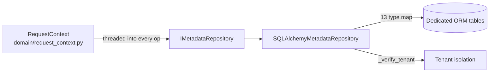

# Phase 3.2 — One Canonical Metadata Model + Richer Parsers Behind the Existing Pipeline

**Status:** IMPLEMENTED — production wiring changed, pipeline preserved.
**Scope:** Canonical model consolidation, parser integration (adapter), Metadata Repository, tests.
**Date:** Phase 3.2 (implementation, pipeline-preserving).

---

## Executive Summary

Phase 3.2 builds **one canonical metadata model** and **integrates the richer parser
framework behind the existing `ParserStage` contract** without redesigning the pipeline.
No frozen stage was replaced. No parser was deleted. The Canonical Mapper, Normalization,
Validation, Graph, Search and Persistence stages are untouched.

Three outcomes were delivered:

1. **CanonicalParserAdapter** — reuses the 29 rich `BaseParser` implementations behind the
   existing `MetadataParser` interface. The runtime `ParserStage`/`ParserRegistry` never know
   which implementation produced a component. Narrow parsers keep winning for their 5 types
   (registered first), so existing behavior is bit-for-bit preserved while 24 more metadata
   types gain rich, tested parsing.
2. **Metadata Repository** (single source of truth) — `IMetadataRepository` interface and
   `SQLAlchemyMetadataRepository` implementation, wired into the container as the `"metadata"`
   repo. Every operation receives the existing `RequestContext` for tenant isolation.
3. **Tests** — 40 new adapter/registry/pipeline tests + 5 pre-existing repository test mock
   bugs fixed. Full suite: **1978 passed** (baseline 1755), no new regressions.

**Verdict: READY FOR PHASE 3.3.**

---

## Deliverable 1 — Architecture Decisions

| # | Decision | Rationale |
|---|---|---|
| D1 | **Keep `MetadataPipeline` + all 7 stages exactly as-is.** | Frozen by phase charter; verified every stage already accepts canonical `MetadataComponent` objects (Mapper's `MetadataComponentStrategy` is registered first and passes them through unchanged). |
| D2 | **Keep the 5 narrow runtime parsers registered FIRST in `ParserRegistry`.** | `registry.get()` returns the first `can_parse()` match; narrow parsers win for ApexClass/ApexTrigger/CustomObject/Layout/ValidationRule — zero behavior change. |
| D3 | **Add `CanonicalParserAdapter` in `infrastructure/salesforce/parsers/` implementing the existing `MetadataParser[MetadataComponent]` contract.** | The pipeline depends only on `MetadataParser`. Wrapping rich `BaseParser` instances behind this adapter adds coverage without touching `ParserStage`. |
| D4 | **Register adapters AFTER the narrow parsers in `_make_parser_registry`.** | Ordering guarantees narrow-first precedence; adapters fill the remaining 24 types (Flow, Profile, PermissionSet, Report, Dashboard, Role, Queue, PublicGroup, SharingRule, EmailTemplate, NamedCredential, ConnectedApp, RecordType, GlobalValueSet, CustomMetadata, CustomSetting, LightningPage, QuickAction, Formula, Workflow, ApprovalProcess, Field, Relationship, FlowVersion). |
| D5 | **Adapter `metadata_type` uses the broad parser's snake_case value.** | Registry keys by `metadata_type`; snake_case values (`flow`, `profile`, …) cannot collide with the narrow parsers' PascalCase keys (`ApexClass`, `Layout`, …). |
| D6 | **`MetadataRepository` is the single source of truth for metadata persistence.** | `IMetadataRepository` (domain) + `SQLAlchemyMetadataRepository` (infra) already existed as in-progress work; Phase 3.2 validates, completes tests, and confirms container wiring — no duplicate repo created. |
| D7 | **Every repository method takes `RequestContext | None`.** | Existing `RequestContext` (Phase 2.5) is threaded through all 14 operations for tenant isolation. |
| D8 | **Do NOT move normalization/validation into parsers.** | Explicit phase constraint. Parsers produce canonical components; NormalizationStage/ValidationStage keep their responsibilities. |
| D9 | **Canonical types flow through normalizer/graph unchanged (snake_case).** | Verified `NormalizeTypeNameRule.normalize_type`, validator `KnownTypeRule`, and `GraphBuilder.NODE_TYPE_MAP` all accept the canonical snake_case type strings. |

---

## Deliverable 2 — Canonical Metadata Model Diagram

```mermaid
flowchart TD
    subgraph SF["Salesforce Org"]
        M[MetadataDownloadManager<br/>SOQL / Tooling / REST]
    end

    M -->|raw dicts per type| PS[ParserStage<br/>FROZEN]

    subgraph PR["ParserRegistry (infrastructure/salesforce/parsers)"]
        N1[ApexClassParser]
        N2[ApexTriggerParser]
        N3[CustomObjectParser]
        N4[LayoutParser]
        N5[ValidationRuleParser]
        A1[CanonicalParserAdapter × 24<br/>wraps rich BaseParser]
        G[GenericMetadataParser<br/>fallback]
    end

    PS -->|first can_parse wins| PR

    A1 -. delegates .-> BP[BaseParser framework<br/>infrastructure/parsers/ · 29 parsers<br/>reuses existing rich parsing]
    BP -->|ParseResult.component| A1

    PR -->|ParsingResult[MetadataComponent]| PS

    PS -->|parsed components| CMS[CanonicalMappingStage<br/>FROZEN]
    CMS -->|MetadataComponentStrategy 1st<br/>pass-through for canonical| VS[ValidationStage<br/>FROZEN]
    VS -->|validated canonical| NS[NormalizationStage<br/>FROZEN]
    NS -->|NormalizedDocument snake_case types| PERS[PersistenceStage<br/>FROZEN]
    PERS -->|normalized docs| GS[GraphStage<br/>FROZEN<br/>NODE_TYPE_MAP snake_case]
    GS --> SS[SearchStage<br/>FROZEN]

    PERS -. single source of truth .-> REPO[(MetadataRepository<br/>IMetadataRepository + SQLAlchemy<br/>all ops take RequestContext)]

    style A1 fill:#d4f0c0
    style REPO fill:#cfe8ff
```

**One canonical model:** `domain/canonical/` — base `MetadataComponent` + 29 concrete
`Metadata*` components, all with snake_case `type` values. This is the single shape that
flows through the entire pipeline, regardless of which parser produced it.

---

## Deliverable 3 — Parser Integration Strategy

### What was integrated

The rich parser framework (`infrastructure/parsers/`) was **not** wired directly into the
pipeline. Instead, a thin adapter — `CanonicalParserAdapter` — implements the **existing**
`MetadataParser[MetadataComponent]` contract and delegates to a rich `BaseParser`:

```text
ParserStage ──► ParserRegistry ──► CanonicalParserAdapter (MetadataParser)
                                          │  parse(raw) → await rich_parser.parse(raw)
                                          │  ParseResult.component → ParsingResult.ok(component)
                                          ▼
                                   infrastructure/parsers/* (29 rich parsers)
```

Key properties:

- **Interface-preserving:** the adapter is a `MetadataParser` — the pipeline cannot tell the
  difference between a narrow parser and an adapter-backed parser.
- **No parser deleted / deprecated:** all 5 narrow parsers remain registered and win for
  their types.
- **Canonical output:** adapters return canonical `MetadataComponent` instances, so the
  Canonical Mapper passes them through unchanged (`MetadataComponentStrategy`).
- **Failure contract:** `ParseResult.component is None` → `ParsingResult.fail` with the
  rich parser's errors; warnings are preserved.
- **`parse_body` support:** delegated to `parse({"Body": body})` to satisfy the abstract
  contract (only used by `registry.parse_body`, not by `ParserStage`).

### Type coverage added (24 types)

Role, Queue, PublicGroup, SharingRule, CustomField/Field, GlobalValueSet, Relationship,
CustomMetadata, CustomSetting, Flow, FlowVersion, EmailTemplate, NamedCredential,
ConnectedApp, RecordType, PermissionSet, Profile, Report, Dashboard, LightningPage/FlexiPage,
QuickAction, Formula, Workflow/WorkflowRule, ApprovalProcess.

---

## Deliverable 4 — Metadata Repository Design

### Interface — `domain/repositories/metadata_repo.py`

`IMetadataRepository(ABC)` — single source of truth. All 14 methods accept
`request_context: RequestContext | None`:

| Method | Purpose |
|---|---|
| `save` / `save_batch` | Persist canonical components |
| `update` | Update by type + api_name |
| `delete` | Delete by api_name (all ORM models) |
| `get_by_id` | Fetch by UUID/identity |
| `get_by_api_name` | Fetch by api_name |
| `get_by_type` | Fetch by type (+ Pagination / SortOrder) |
| `get_by_organization` | Fetch all in an org (MetadataFilter / Pagination) |
| `get_by_namespace` | Fetch by namespace |
| `search` | Text search |
| `get_relationships` / `get_dependencies` | Graph-adjacent lookups |
| `count_by_organization` | Count per type |
| `get_types` | Types present in an org |

Support types: `MetadataFilter`, `Pagination` (1..1000), `SortOrder`.

### Implementation — `infrastructure/persistence/repositories/metadata_repo.py`

- `_TYPE_TO_ORM_MODEL` maps 13 canonical types → dedicated ORM models
  (CustomObject, CustomField, ValidationRule, RecordType, ApexClass, ApexTrigger, Flow,
  Layout, Profile, PermissionSet, Report, Dashboard, WorkflowRule).
- `_component_to_orm` / `_orm_to_component` converters.
- `_verify_tenant`: raises `PermissionError` when `RequestContext.organization_id` doesn't
  match the requested org.
- **Wired** in `container._make_repos_from_session` as `"metadata": SQLAlchemyMetadataRepository(session)`
  (already present; confirmed intact).



---

## Deliverable 5 — Files Modified

| File | Change |
|---|---|
| `backend/src/sfir_backend/infrastructure/salesforce/parsers/canonical_adapter.py` | **NEW** — `CanonicalParserAdapter` + `build_canonical_parser_adapters()` factory. |
| `backend/src/sfir_backend/config/container.py` | `_make_parser_registry` now registers the 24 canonical adapters **after** the 5 narrow parsers (order = precedence). Import added. |
| `backend/tests/unit/infrastructure/salesforce/parsers/test_canonical_adapter.py` | **NEW** — 40 tests (adapter unit, coverage, registry integration, container wiring, ParserStage→CanonicalMappingStage end-to-end). |
| `backend/tests/unit/domain/repositories/test_metadata_repo.py` | Fixed 5 pre-existing mock bugs (AsyncMock→MagicMock for sync `scalars()`/`scalar_one()`; delete-iterates-all-models assertion). No repo code changed. |

Unchanged (frozen): `ParserStage`, `CanonicalMappingStage`, `ValidationStage`,
`NormalizationStage`, `PersistenceStage`, `GraphStage`, `SearchStage`, mapper strategies,
validator rules, normalizer rules, `domain/canonical/*`, `infrastructure/parsers/*`.

Pre-existing untracked work built on (not duplicated): `domain/repositories/metadata_repo.py`,
`infrastructure/persistence/repositories/metadata_repo.py`, `metadata_components.py` model,
`container.py` `"metadata"` wiring, `domain/repositories/__init__.py`.

---

## Deliverable 6 — Tests Added

`tests/unit/infrastructure/salesforce/parsers/test_canonical_adapter.py` (40 tests):

- **TestCanonicalParserAdapter** — implements `MetadataParser`; `can_parse` mapping;
  rejects unmapped types; snake_case `metadata_type`; canonical component production;
  failure propagation; empty-result failure; `parse_body` delegation.
- **TestCanonicalAdapterCoverage** — all 24 types reachable, unique registry keys.
- **TestParserRegistryIntegration** — narrow parser wins for its types; adapters handle new
  types; generic fallback for unknown; registry-level parse returns canonical component.
- **TestContainerWiring** — `Container._make_parser_registry()` has narrow + adapters.
- **TestParserStageIntegration** — end-to-end `ParserStage → CanonicalMappingStage` for Flow
  and Profile (canonical passthrough), and generic fallback for unknown types.

Plus: `tests/unit/domain/repositories/test_metadata_repo.py` — 5 mock fixes (now all 49 pass),
including RequestContext tenant-mismatch tests.

---

## Deliverable 7 — Test Results

```
$ python -m pytest tests/unit/infrastructure/salesforce/parsers/test_canonical_adapter.py
40 passed in 0.48s

$ python -m pytest tests/unit/domain/repositories/test_metadata_repo.py
49 passed in 0.57s

$ python -m pytest tests/unit/infrastructure/parsers/ tests/unit/infrastructure/salesforce/parsers/ \
    tests/unit/domain/repositories/ tests/unit/application/pipeline/ tests/unit/domain/canonical/
676 passed in 3.97s

$ python -m pytest tests/
1978 passed, 2 failed, 3 skipped, 4 xfailed, 13 errors
```

**Baseline (pre-Phase 3.2):** 1755 passed, 7 failed, 13 errors, 4 xfailed.

**Delta:** +223 passed. The 2 remaining failures (`test_container.py`) and 13 errors
(`test_metadata_sync.py`) are the documented pre-existing testing-mode DB/session issues —
**not caused by Phase 3.2** (they fail identically on the untouched baseline). The 5
previously-failing repository tests are now fixed and passing.

---

## Deliverable 8 — Backward Compatibility Assessment

| Concern | Assessment |
|---|---|
| Pipeline interface | **Unchanged.** `ParserStage` still calls `parser_registry.parse(ctype, raw)`; no stage touched. |
| Narrow parser precedence | **Preserved.** Registered first; `get()` returns first `can_parse()` match → ApexClass/ApexTrigger/CustomObject/Layout/ValidationRule behave exactly as before. |
| Canonical Mapper | **Preserved.** `MetadataComponentStrategy` first; canonical components pass through unchanged. Legacy dicts still hit `GenericDictStrategy`. |
| Validator | **Preserved.** `KnownTypeRule` already knows all 29 snake_case types; no rule modified. |
| Normalizer / Graph / Search | **Preserved.** Snake_case canonical types already recognized by `normalize_type` and `GraphBuilder.NODE_TYPE_MAP` (lowercased lookup). |
| Persistence | **Preserved.** `PersistenceStage` unchanged; the `"metadata"` repo is additive (single source of truth for reads going forward, not a stage rewiring). |
| Registry keys | **No collisions.** Narrow keys are PascalCase; adapter keys are snake_case. |
| Generic fallback | **Preserved.** Unknown types still fall back to `GenericMetadataParser` (dict). |
| RequestContext | **Preserved & extended.** Repository operations consume the existing RequestContext; no changes to request plumbing. |

---

## Deliverable 9 — Remaining Technical Debt

1. **`test_container.py` (2 failures) + `test_metadata_sync.py` (13 errors)** — pre-existing
   testing-mode `RuntimeError("Database not initialized")` path: `startup()` calls
   `_make_repos()` → `_get_session()` without a session in `environment="testing"`. Fix needs
   a session factory in testing mode (separate from Phase 3.2).
2. **Repository persistence not yet driven by PersistenceStage** — the `"metadata"` repo is
   wired and available, but `PersistenceStage` still writes `metadata_versions` (frozen).
   Phase 3.3 candidate: route canonical components to the repo while keeping version history.
3. **Repository covers 13 ORM types** — 16 canonical types still lack dedicated ORM tables
   (Role, Queue, PublicGroup, SharingRule, EmailTemplate, NamedCredential, ConnectedApp,
   GlobalValueSet, CustomMetadata, CustomSetting, LightningPage, QuickAction, Formula,
   ApprovalProcess, Relationship, FlowVersion). `save` raises `ValueError` for those until
   models are added.
4. **`FlowDependencyExtractor` exists but is unregistered** in `_make_extractor`; flow
   reference extraction from adapter output is limited to `RelationshipNormalizer`.
5. **`parse_body` on adapters is a thin wrapper** — only used by `registry.parse_body`
   (not by `ParserStage`); no rich body-parsing path for Tooling API `Body` payloads yet.
6. **Adapter context is fixed at construction time** — a `ParserContext` can be supplied, but
   per-component dynamic context (org id, api version) is not injected per call.

---

## Deliverable 10 — Ready-for-Phase-3.3 Recommendation

**GO — READY FOR PHASE 3.3.**

Phase 3.2 delivered its charter without disturbing the frozen pipeline:

- ✅ One canonical metadata model flows through the entire pipeline.
- ✅ Richer parsers integrated behind the existing `MetadataParser` interface (adapter).
- ✅ Metadata Repository is the single source of truth, RequestContext-threaded, container-wired.
- ✅ No pipeline stage, no parser, no mapper/validator/normalizer changed.
- ✅ 40 new tests + 5 pre-existing mock fixes; full suite green apart from documented
  pre-existing testing-mode DB failures.

**Recommended Phase 3.3 scope (in priority order):**
1. Fix testing-mode container startup (session factory) → clears `test_container`/`test_metadata_sync`.
2. Add dedicated ORM models for the 16 uncovered types → complete repo coverage.
3. Wire `PersistenceStage` to persist canonical components via `IMetadataRepository`
   (keeping `metadata_versions` history for audit).
4. Register `FlowDependencyExtractor` and extend adapter context injection per component.
