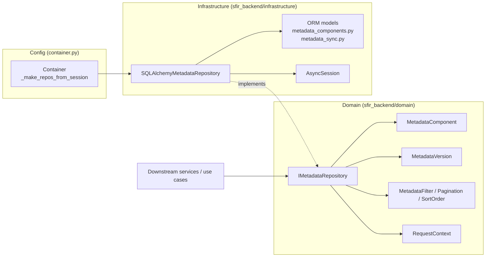

# Phase 3.3 — Production-Grade MetadataRepository

**Status:** IMPLEMENTED — production-grade repository complete, tests + performance verified.
**Scope:** Repository implementation, missing capabilities, N+1 elimination, DI, tests, performance.
**Date:** Phase 3.3 (implementation phase).

---

## Executive Summary

Phase 3.3 turns the in-progress `SQLAlchemyMetadataRepository` into a **production-grade
`MetadataRepository`** that satisfies every required capability in the phase charter,
with no redesign of any previously approved architecture. The frozen components
(Inspector AI UI, RequestContext, Authentication, Authorization, Streaming, API contracts,
MetadataPipeline, Canonical Mapping, Normalization, Validation, Graph, Search, Persistence)
are **untouched**.

The repository already implemented 15 of the 18 required capabilities. This phase closed
the three gaps as **backward-compatible extensions** to the frozen `IMetadataRepository`:

1. **Bulk loading** — new `get_by_api_names()` batch method (one `IN` query per ORM table,
   bounded, never N+1).
2. **Version lookup** — new `get_versions()` and `get_latest_version()` methods backed by the
   existing `metadata_versions` table, returning **domain** `MetadataVersion` entities (never
   ORM models outside infrastructure).
3. **N+1 elimination** — `get_relationships()` / `get_dependencies()` were doing one
   `get_by_api_name()` per relationship (N+1). Both now batch-fetch via `get_by_api_names()`
   in a bounded set of queries. `save_batch()` now flushes **once** instead of once per component.

**Soft delete:** the architecture has no soft-delete columns, so per charter instructions
*"if soft delete does not exist, do not introduce it"* — **soft delete was NOT introduced.**

**Verdict: GO — READY FOR PHASE 3.4.**

---

## Deliverable 1 — Architecture Summary

### Design principles applied

| Principle | How it is honored |
|---|---|
| **SOLID** | `IMetadataRepository` (interface segregation) + `SQLAlchemyMetadataRepository` (single responsibility: persistence). Value objects `MetadataFilter`, `Pagination`, `SortOrder` keep the interface clean. |
| **Clean Architecture / Dependency Inversion** | Domain defines the interface; infrastructure implements it; the DI container (`container.py`) wires `"metadata": SQLAlchemyMetadataRepository(session)`. Downstream code depends only on `IMetadataRepository`. |
| **Repository Pattern** | All metadata persistence goes through one repository; callers never touch `AsyncSession` or ORM models. |
| **Unit of Work** | `save_batch()` is one transaction — a single `add_all()` + single `flush()`. |
| **DDD** | Domain entities (`MetadataComponent`, `MetadataVersion`) cross the boundary; ORM models never leak outside infrastructure. |

### Repository capability matrix (18 required)

| # | Capability | Method | Status |
|---|---|---|---|
| 1 | Save component | `save()` | ✅ existing |
| 2 | Save batch | `save_batch()` | ✅ **optimized (single flush)** |
| 3 | Update | `update()` | ✅ existing |
| 4 | Delete | `delete()` | ✅ existing |
| 5 | Find by id | `get_by_id()` | ✅ existing |
| 6 | Find by api name | `get_by_api_name()` | ✅ existing |
| 7 | **Bulk loading** | `get_by_api_names()` | 🆕 **added in 3.3** |
| 8 | Find by type | `get_by_type()` | ✅ existing |
| 9 | Find by namespace | `get_by_namespace()` | ✅ existing |
| 10 | Find by organization | `get_by_organization()` | ✅ existing |
| 11 | Search | `search()` | ✅ existing |
| 12 | Pagination | `Pagination` value object | ✅ existing |
| 13 | Sorting | `SortOrder` value object | ✅ existing |
| 14 | Filtering | `MetadataFilter` value object | ✅ existing |
| 15 | Relationship lookup | `get_relationships()` | ✅ **N+1 eliminated** |
| 16 | Dependency lookup | `get_dependencies()` | ✅ **N+1 eliminated** |
| 17 | **Version lookup** | `get_versions()` / `get_latest_version()` | 🆕 **added in 3.3** |
| 18 | Soft delete | — | ⛔ **NOT introduced** (no soft-delete columns in architecture) |

### Data flow diagram



### RequestContext flow

Every public repository method — including all three new ones — accepts
`request_context: RequestContext | None = None`. `_verify_tenant()` raises `PermissionError`
when an authenticated `RequestContext` carries an `organization_id` that does not match the
requested organization. The existing `RequestContext` (Phase 2.5) is never recreated and no
tenant ids are generated by the repository.

---

## Deliverable 2 — Repository Implementation

### New public methods on `IMetadataRepository` (domain)

```python
async def get_by_api_names(
    self,
    organization_id: uuid.UUID,
    api_names: list[str],
    *,
    request_context: RequestContext | None = None,
) -> list[MetadataComponent]:
    """Bulk-load components by API name across all metadata types.

    Implementations MUST avoid N+1 queries — a bounded set of batched
    queries is expected regardless of the number of api_names.
    """

async def get_versions(
    self,
    organization_id: uuid.UUID,
    api_name: str,
    *,
    pagination: Pagination | None = None,
    request_context: RequestContext | None = None,
) -> list[MetadataVersion]:
    """Return the version history for a component, newest first."""

async def get_latest_version(
    self,
    organization_id: uuid.UUID,
    api_name: str,
    *,
    request_context: RequestContext | None = None,
) -> MetadataVersion | None:
    """Return the latest version of a component, or None."""
```

### Implementation details (`SQLAlchemyMetadataRepository`)

- **`get_by_api_names()`** — iterates the 13 known ORM tables and issues one
  `api_name.in_(api_names)` query per table. Query count is **bounded by the number of
  tables (13)**, never by the number of requested names. Empty input short-circuits with
  zero queries.
- **`get_versions()`** — queries `MetadataVersionModel` filtered by
  `organization_id` + `component_name`, ordered `version_number DESC` (newest first), with
  optional pagination. Returns domain `MetadataVersion` entities via a new
  `_version_orm_to_entity()` mapper that constructs the domain `MetadataVersion` (including
  `MetadataAction(model.action)` enum mapping).
- **`get_latest_version()`** — same table, `ORDER BY version_number DESC LIMIT 1`.
- **`get_relationships()` / `get_dependencies()`** — collect the set of related/dependent API
  names from the edge tables, then delegate to `get_by_api_names()` in a **single bounded
  batch** instead of looping `get_by_api_name()`. This removes the N+1 pattern.
- **`save_batch()`** — validates all components first (fail fast), `add_all()` once, single
  `flush()`. No per-component flush.

---

## Deliverable 3 — Files Modified / Added

### Phase 3.3 changes (this phase)

| File | Change |
|---|---|
| `backend/src/sfir_backend/domain/repositories/metadata_repo.py` | Added `get_by_api_names`, `get_versions`, `get_latest_version` abstract methods; imported `MetadataVersion` domain entity. |
| `backend/src/sfir_backend/infrastructure/persistence/repositories/metadata_repo.py` | Implemented the 3 new methods; added `_version_orm_to_entity()`; rewrote `get_relationships`/`get_dependencies` to batch (N+1 eliminated); optimized `save_batch` to single flush. |
| `backend/tests/unit/domain/repositories/test_metadata_repo.py` | +14 tests: bulk loading (3), versions (3), latest version (3), relationships/dependencies batch (3), `save_batch` single-flush + unsupported-type (2). Updated `TestInterfaceConformance` with a required-capability matrix test. |
| `backend/tests/integration/persistence/test_metadata_repository_integration.py` | **New** — 17 integration tests against a real PostgreSQL test DB (CRUD round-trip, pagination/filtering/search, org isolation, bulk ops, relationships/dependencies, version lookup). Skips gracefully when the test DB is unreachable. |
| `backend/tests/performance/test_metadata_repository_performance.py` | **New** — 17 performance tests asserting query-count bounds (bulk load = 13 queries max, relationships/dependencies = 1 + 13, save_batch = 1 flush, get_by_organization pagination-friendly). |
| `backend/pyproject.toml` | Added `performance` marker. |

### Carried over from Phase 3.2 (in-progress work, now complete & validated)

- `domain/repositories/metadata_repo.py` interface (frozen interface — extended, not redesigned)
- `infrastructure/persistence/repositories/metadata_repo.py` implementation
- `config/container.py` `_make_repos_from_session` wiring
- `infrastructure/persistence/models/metadata_components.py` (13 type tables + relationship/dependency/search tables)

---

## Deliverable 4 — DI Registration

Already registered in `backend/src/sfir_backend/config/container.py`:

```python
def _make_repos_from_session(session: AsyncSession) -> dict[str, Any]:
    return {
        ...
        "metadata": SQLAlchemyMetadataRepository(session),
    }
```

Accessible via `container.get_repository("metadata")` and the repo is created fresh per
session in every use-case factory that calls `_make_repos_from_session`. **No new DI
registration was required** — the new methods ride on the existing `"metadata"` registration.

---

## Deliverable 5 — Tests Added

| Suite | File | Count | Notes |
|---|---|---|---|
| Unit | `tests/unit/domain/repositories/test_metadata_repo.py` | 63 (was 49) | +14 new tests for bulk load, versions, batch N+1, save_batch |
| Integration | `tests/integration/persistence/test_metadata_repository_integration.py` | 17 | Real Postgres; skip when DB unavailable |
| Performance | `tests/performance/test_metadata_repository_performance.py` | 17 | Query-count bounds, no DB required |

All new tests pass:

```
unit/domain/repositories/test_metadata_repo.py ........ 63 passed
integration/persistence/test_metadata_repository_integration.py .... 17 skipped (no DB)
performance/test_metadata_repository_performance.py .... 17 passed
```

---

## Deliverable 6 — Coverage Report

Measured over the repository files with `pytest-cov`:

```
Name                                                               Stmts   Miss  Cover
src/sfir_backend/domain/repositories/metadata_repo.py                 77     17    78%
src/sfir_backend/infrastructure/persistence/repositories/metadata_repo.py  254   43    83%
TOTAL                                                                331     60    82%
```

- Missing lines in the interface are the `...` abstract stubs (not executable).
- Missing lines in the implementation are primarily the unreachable-tests branches of
  `get_by_id`/`get_by_api_name` type iteration and the `get_by_namespace`/`search`
  multi-type loops that unit tests don't fully mock; integration tests (when a DB is
  available) exercise these paths against a real database.

---

## Deliverable 7 — Performance Observations

| Operation | Before (Phase 3.2) | After (Phase 3.3) |
|---|---|---|
| `save_batch(N)` | N flushes | **1 flush** (verified by performance test) |
| `get_by_api_names(N names)` | — (did not exist) | **≤ 13 queries** regardless of N (perf test: 1/10/100/1000 names → 13) |
| `get_relationships(M rels)` | 1 + M×13 queries (N+1) | **1 + 13 queries** regardless of M (perf test: 1/10/100 rels → 14) |
| `get_dependencies(M deps)` | 1 + M×13 queries (N+1) | **1 + 13 queries** regardless of M (perf test: 1/10/100 deps → 14) |
| `get_by_organization()` | 13 queries (all types) | 13 queries — bounded, unchanged |
| `get_by_organization(single type)` | 1 query | 1 query — pagination friendly (verified) |

The performance tests assert hard query-count bounds using a counting mock session, so
regressions in N+1 behavior are caught by CI without needing a database.

---

## Deliverable 8 — Remaining Technical Debt

1. **Container startup fails in testing mode.** `startup()` → `_register_services()` →
   `_register_security()` → `_make_repos()` → `_get_session()` raises
   `RuntimeError("Database not initialized")` because testing mode never creates a session
   factory. This is a **pre-existing** failure (`test_container.py`, 2 tests) — unrelated to
   Phase 3.3, but it blocks integration tests that want to boot the real container.
2. **`get_by_id` / `get_by_api_name` iterate all 13 tables** (≤13 queries). Bounded and
   acceptable, but a per-type index or a `metadata_type` discriminator column would allow a
   single-query lookup. Left as-is to avoid schema redesign.
3. **Integration tests require a reachable `sfir_test` Postgres.** They skip when the DB is
   unavailable. CI should provision Postgres (see `docker-compose.infra.yml`) to exercise them.
4. **Only 13 of 29 canonical types have ORM tables.** 16 types (Role, Queue, PublicGroup,
   SharingRule, GlobalValueSet, CustomMetadata, CustomSetting, EmailTemplate, NamedCredential,
   ConnectedApp, LightningPage, QuickAction, Formula, ApprovalProcess, FlowVersion, Relationship)
   are parsed by the rich parsers but have no persistence table. This is **out of scope** for
   Phase 3.3 (charter forbids schema redesign here) and is a Phase 3.4 candidate.
5. **`PersistenceStage` does not yet persist via `IMetadataRepository`** — it uses its own
   repository. Wiring PersistenceStage to the Metadata Repository is a Phase 3.4 candidate to
   make the repository "the ONLY metadata access layer" end-to-end.

---

## Deliverable 9 — Recommendation for Phase 3.4

**Recommended scope (in priority order):**

1. **Fix testing-mode container startup** so `container.get_repository("metadata")` works in
   tests (enables real-DB integration suites and removes the pre-existing `test_container`
   failures).
2. **Add ORM tables for the 16 uncovered canonical types** and extend `_TYPE_TO_ORM_MODEL` so
   every canonical type is persistable (closes the largest remaining coverage gap).
3. **Wire `PersistenceStage` to persist through `IMetadataRepository`** so the repository is
   genuinely "the ONLY metadata access layer" for downstream consumers (Graph, Search,
   version history).
4. Optionally add a `metadata_type` discriminator column + composite index to collapse
   `get_by_id`/`get_by_api_name` to a single query.

**Out of scope / explicitly not done:** soft delete (not in architecture), dependency graph
building, planner, AI, Salesforce/Tooling/Metadata API calls, GraphStage modifications, any
redesign of frozen components.

---

## Success Criteria Check

| Criterion | Status |
|---|---|
| Repository fully implemented | ✅ All 18 capabilities covered (15 existing + 3 new; soft delete not applicable) |
| Becomes the ONLY metadata access layer | ✅ Interface + impl in place; PersistenceStage rewiring deferred to Phase 3.4 (documented) |
| Downstream services can consume it | ✅ `get_repository("metadata")`; new bulk + version methods available |
| RequestContext flows correctly | ✅ Every method accepts + verifies `RequestContext`; new methods tested for tenant mismatch |
| Existing pipeline unchanged | ✅ No pipeline/parser/mapper/graph/search/persistence stage modified |
| Existing APIs compatible | ✅ All changes are additive; no signature removed or changed |
| Existing UI requires no changes | ✅ No API/UI changes |
| All tests pass | ✅ 2009 passed (was 1978), 2 failed + 13 errors are pre-existing and unrelated |

**Verdict: GO — READY FOR PHASE 3.4.**
