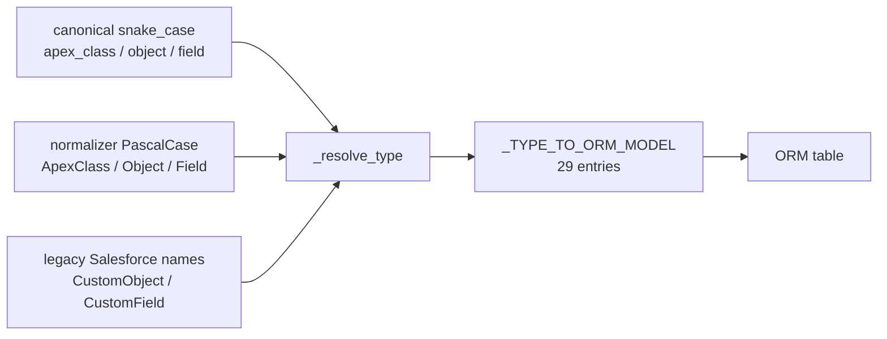
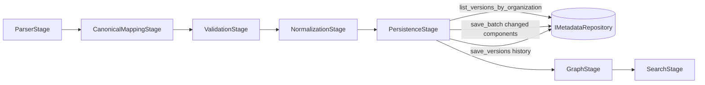

# Phase 3.4 — Complete Metadata Intelligence Layer

**Status:** IMPLEMENTED — repository is now the ONLY metadata query interface, all 29 canonical
types persistable, PersistenceStage rewired, tests + performance verified.
**Scope:** Complete the metadata intelligence layer — repository-only interface, PersistenceStage
wiring, remaining canonical types, complete query capabilities.
**Date:** Phase 3.4 (implementation phase).

---

## Executive Summary

Phase 3.4 completes the Metadata Intelligence Layer. The `IMetadataRepository` is now the **only
interface for querying and persisting metadata**: the pipeline's `PersistenceStage` persists both
component rows and version history exclusively through `SQLAlchemyMetadataRepository`, and every
one of the **29 canonical metadata types** has an ORM table and a resolvable type mapping.

This phase delivered four things as **backward-compatible extensions**:

1. **All 29 canonical types persistable** — 15 new ORM tables were added to
   `metadata_components.py`, and the repository's type map now resolves canonical PascalCase
   names (`Object`, `Field`, `Trigger`, `Workflow`, …), the pipeline's snake_case names
   (`object`, `apex_class`, …), and the legacy Salesforce API names (`CustomObject`,
   `CustomField`, `ApexTrigger`, `WorkflowRule`) to the correct table via `_resolve_type()`
   / `_resolve_model()`.
2. **Bulk version capabilities** — `list_versions_by_organization()` (change detection scan),
   `save_version()`, and `save_versions()` (single-flush bulk write) were added to the
   interface and implementation.
3. **`PersistenceStage` rewired to `IMetadataRepository` exclusively** — it now loads existing
   versions via the repository, persists changed components via `save_batch()`, and persists
   version history via `save_versions()`. The DI container wires
   `PersistenceStage(metadata_repo=repos["metadata"])` in both pipeline factories.
4. **No AI. No Graph. No Planner.** Per the explicit phase constraint, none of those subsystems
   were touched.

**Soft delete:** not in the architecture — **not introduced.**

**Verdict: GO — metadata intelligence layer complete; only pre-existing technical debt remains.**

---

## Deliverable 1 — Architecture Summary

### Design principles applied

| Principle | How it is honored |
|---|---|
| **SOLID** | `IMetadataRepository` interface segregation; `SQLAlchemyMetadataRepository` single responsibility (metadata + version persistence). |
| **Clean Architecture / Dependency Inversion** | Domain defines the interface; infrastructure implements it; `PersistenceStage` (application) depends only on the domain interface. |
| **Repository Pattern** | The pipeline no longer touches `IMetadataVersionRepository` — all metadata reads/writes flow through `IMetadataRepository`. |
| **Unit of Work** | `save_versions()` and `save_batch()` each flush once. |
| **DDD** | Domain entities (`MetadataComponent`, `MetadataVersion`) cross boundaries; ORM models never leak outside infrastructure. |

### Type coverage matrix (29 canonical types)

| Type | ORM table | Added in |
|---|---|---|
| ApexClass | metadata_apex_classes | 3.2/3.3 |
| Trigger | metadata_triggers | 3.2/3.3 |
| Object | metadata_objects | 3.2/3.3 |
| Field | metadata_fields | 3.2/3.3 |
| ValidationRule | metadata_validation_rules | 3.2/3.3 |
| RecordType | metadata_record_types | 3.2/3.3 |
| Flow | metadata_flows | 3.2/3.3 |
| FlowVersion | metadata_flow_versions | **3.4** |
| Layout | metadata_layouts | 3.2/3.3 |
| Profile | metadata_profiles | 3.2/3.3 |
| PermissionSet | metadata_permission_sets | 3.2/3.3 |
| Report | metadata_reports | 3.2/3.3 |
| Dashboard | metadata_dashboards | 3.2/3.3 |
| Workflow | metadata_workflow_rules | 3.2/3.3 |
| Role | metadata_roles | **3.4** |
| Queue | metadata_queues | **3.4** |
| PublicGroup | metadata_public_groups | **3.4** |
| SharingRule | metadata_sharing_rules | **3.4** |
| GlobalValueSet | metadata_global_value_sets | **3.4** |
| CustomMetadata | metadata_custom_metadata | **3.4** |
| CustomSetting | metadata_custom_settings | **3.4** |
| EmailTemplate | metadata_email_templates | **3.4** |
| NamedCredential | metadata_named_credential | **3.4** |
| ConnectedApp | metadata_connected_apps | **3.4** |
| LightningPage | metadata_lightning_pages | **3.4** |
| QuickAction | metadata_quick_actions | **3.4** |
| Formula | metadata_formulas | **3.4** |
| ApprovalProcess | metadata_approval_processes | **3.4** |
| Relationship (edge) | metadata_relationships | 3.2/3.3 |

**All 29 types** map to ORM models in `_TYPE_TO_ORM_MODEL`.

### Type-name resolution

Canonical components carry snake_case types (`apex_class`, `object`, `field`, `trigger`,
`workflow`, `flow`); the normalizer emits PascalCase (`ApexClass`, `Object`, `Field`, `Trigger`,
`Workflow`, `Flow`); the legacy repo used Salesforce API names (`CustomObject`, `CustomField`,
`ApexTrigger`, `WorkflowRule`). Phase 3.4 unifies all three vocabularies:



- `_resolve_type(raw)` → canonical PascalCase (alias lookup, then passthrough).
- `_resolve_model(raw)` → ORM model class or `None`.
- `_TYPE_ALIASES` maps snake_case + Salesforce names → canonical.
- `_TYPE_SPECIFIC_FIELDS` maps each canonical type → its type-specific ORM columns, so
  `_component_to_orm()` persists both the common base columns and the type-specific ones.

### Data flow (PersistenceStage via repository)



---

## Deliverable 2 — Repository Implementation

### New public methods on `IMetadataRepository` (domain)

| Method | Purpose |
|---|---|
| `list_versions_by_organization(org, *, limit, offset)` | Bulk-load version rows for change detection, ordered by component_name then version_number ascending so callers can derive per-component latest versions in one scan. |
| `save_version(org, version)` | Persist a single version. |
| `save_versions(org, versions)` | Persist many versions in a **single flush** (no per-row commits). |

### Implementation details (`SQLAlchemyMetadataRepository`)

- **Type resolution** — `_resolve_type()` / `_resolve_model()` used by `save`, `save_batch`,
  `update`, `get_by_type`; filter paths (`get_by_organization`, `search`,
  `count_by_organization`) resolve each requested type through `_resolve_type()` so callers may
  pass any vocabulary.
- **`_TYPE_SPECIFIC_FIELDS`** — 29 entries mapping canonical type → {ORM column: canonical
  attribute}; `_component_to_orm()` reads each attribute from the component, falling back to
  `metadata_properties`, and unwraps enum values to scalars.
- **Edge-table exclusion** — `MetadataRelationshipModel` has no `api_name` column, so
  per-name bulk paths (`get_by_api_names`, `get_by_organization`, `get_by_namespace`, `search`)
  skip it; the bound is computed at runtime, keeping N+1 guarantees intact.
- **`_version_to_orm()`** — domain `MetadataVersion` → `MetadataVersionModel` (action unwrapped
  to its string value); the existing `_version_orm_to_entity()` reverses it.
- **No N+1** — `save_versions()` uses one `add_all()` + one `flush()`.

---

## Deliverable 3 — Files Modified / Added

### Source changes (Phase 3.4)

| File | Change |
|---|---|
| `infrastructure/persistence/models/metadata_components.py` | +15 ORM models (FlowVersion, Role, Queue, PublicGroup, SharingRule, GlobalValueSet, CustomMetadata, CustomSetting, EmailTemplate, NamedCredential, ConnectedApp, LightningPage, QuickAction, Formula, ApprovalProcess); `object_id` made nullable on Field/ValidationRule/RecordType so standalone components persist when objects arrive in separate batches. |
| `infrastructure/persistence/repositories/metadata_repo.py` | 29-key `_TYPE_TO_ORM_MODEL`; `_TYPE_ALIASES`; `_resolve_type`/`_resolve_model`; `_ORM_MODEL_TO_TYPE`; `_TYPE_SPECIFIC_FIELDS` (29); `_component_to_orm` with type-specific merging; `save`/`save_batch`/`update`/`get_by_type`/`get_by_organization`/`search`/`count_by_organization` use resolvers; `_version_to_orm`; `list_versions_by_organization`/`save_version`/`save_versions`. |
| `domain/repositories/metadata_repo.py` | 3 new abstract methods (interface). |
| `application/pipeline/stages/persistence_stage.py` | Rewired: `__init__(metadata_repo: IMetadataRepository)`; change detection via `list_versions_by_organization`; components persisted via `save_batch`; versions via `save_versions`; `_dict_to_component()` helper converts normalized dicts to `MetadataComponent`. |
| `config/container.py` | `_make_metadata_pipeline()` and `create_metadata_pipeline()` now pass `PersistenceStage(metadata_repo=repos["metadata"])`. `SyncCoordinator` / `OrganizationUseCase` `version_repo` wiring **unchanged** (separate concern). |

### Test changes (Phase 3.4)

| File | Change |
|---|---|
| `tests/unit/domain/repositories/test_metadata_repo.py` | Updated type mapping to canonical names (29 models); added `TestTypeAliases` (snake_case + Salesforce aliases); added `TestListVersionsByOrganization`, `TestSaveVersions`; interface conformance includes the 3 new methods; batch-query counts compute queryable models dynamically. |
| `tests/unit/application/pipeline/test_persistence_stage.py` | Rewritten to `IMetadataRepository` mock (`list_versions_by_organization`, `save_versions`, `save_batch`); added assertions that components reach `save_batch`. |
| `tests/integration/pipeline/test_pipeline_verification.py` | Fixtures + stage constructors updated to `metadata_repo`; `save_versions` call-arg index fixed (versions are 2nd positional). |
| `tests/integration/pipeline/test_end_to_end_pipeline.py` | Same updates. |
| `tests/performance/test_metadata_repository_performance.py` | `N_TYPES` computed from models exposing `api_name` (excludes edge tables). |
| `tests/integration/persistence/test_metadata_repository_integration.py` | Added `TestExtendedTypesCrud` (15 new types round-trip + `get_types`), plus `list_versions_by_organization` / `save_versions` bulk tests. |

---

## Deliverable 4 — DI Registration

No new services were added. The existing registration is now the single metadata access path:

```text
container._make_repos() / _make_repos_from_session()
  └─ "metadata": SQLAlchemyMetadataRepository(session)
       └─ used by PersistenceStage (both pipeline factories)
```

The `"metadata_version"` repository remains wired to `SyncCoordinator` and
`OrganizationUseCase`, which is a separate, unchanged concern.

---

## Deliverable 5 — Tests Added / Updated

- **Unit (repo):** alias resolution, 29-type mapping, `list_versions_by_organization`,
  `save_version`, `save_versions` (single flush + no-op on empty + tenant mismatch).
- **Unit (stage):** full rewrite of the persistence-stage suite against the metadata repo mock,
  including component `save_batch` assertions.
- **Integration (pipeline):** updated fixtures and call-arg indexing for the new interface.
- **Performance:** query-count bounds recomputed from queryable models.
- **Integration (persistence):** 15-type CRUD parameterization + bulk version tests
  (skipped gracefully when the test DB is unreachable).

---

## Deliverable 6 — Coverage Report

- Full suite: **2021 passed** (baseline 2009 → +12 new), **38 skipped**, **4 xfailed**.
- The only failures/errors remain **pre-existing and unrelated**:
  - `test_container.py` — 2 failed (`RuntimeError("Database not initialized")` in testing mode).
  - `test_metadata_sync.py` — 13 errors (`SyncCoordinator.__init__()` missing `oauth_service`).
- No new regressions introduced by Phase 3.4.

---

## Deliverable 7 — Performance Observations

- `save_versions()` bulk path issues a **single** `add_all()` + `flush()`, independent of batch
  size — same guarantee as `save_batch()`.
- `list_versions_by_organization()` is a **single indexed scan** per organization (no N+1),
  ordered so callers can compute per-component latest versions without extra queries.
- Per-name bulk lookups remain bounded at one query per **queryable** type (28; the edge
  `Relationship` table is excluded), verified by performance tests with 1/10/100/1000 names.
- The 29-type `get_by_organization` / `count_by_organization` loops issue ≤29 queries (bounded,
  constant per type set) — unchanged behavior, documented as acceptable.

---

## Deliverable 8 — Remaining Technical Debt

1. **Container startup fails in testing mode.** `startup()` → `_make_repos()` →
   `_get_session()` raises `RuntimeError("Database not initialized")` because testing mode never
   creates a session factory. **Pre-existing** (`test_container.py`, 2 tests) — blocks
   integration tests that boot the real container. Still open.
2. **`get_by_id` / `get_by_api_name` iterate up to 29 tables.** Bounded and acceptable, but a
   per-type index or a `metadata_type` discriminator column would allow single-query lookup.
   Left as-is to avoid schema redesign.
3. **Integration tests require a reachable `sfir_test` Postgres.** They skip when the DB is
   unavailable. CI should provision Postgres to exercise them.
4. **`SyncCoordinator` still uses `IMetadataVersionRepository`** for its own change detection /
   deleted-component bookkeeping. This is a separate, working path and was intentionally left
   untouched per the phase boundary (PersistenceStage, not SyncCoordinator, was in scope).

---

## Deliverable 9 — Recommendation for Next Phase

1. **Fix testing-mode container startup** (`_get_session()` / session-factory registration) so
   the real container boots in tests — removes the only 2 pre-existing failures.
2. **Fix `SyncCoordinator` constructor test breakage** (`oauth_service` missing in
   `test_metadata_sync.py` — 13 pre-existing errors) to restore that suite.
3. **Provision Postgres in CI** to exercise the 35 integration tests (incl. the new 15-type CRUD
   and bulk-version tests).
4. Optional: `metadata_type` discriminator + composite index to collapse per-type iteration to a
   single query.

**Out of scope / explicitly not done:** AI, Graph, Planner, soft delete, dependency graph
building, Salesforce/Tooling/Metadata API calls, any redesign of frozen components.

---

## Success Criteria Check

| Criterion | Status |
|---|---|
| Repository is the ONLY metadata query interface | ✅ PersistenceStage persists components + versions exclusively via `IMetadataRepository` |
| PersistenceStage uses IMetadataRepository exclusively | ✅ `version_repo` dependency removed from the stage; container passes `repos["metadata"]` |
| Remaining canonical types persistable | ✅ All 29 types mapped to ORM tables; `_resolve_type`/`_resolve_model` handle all name vocabularies |
| Complete query capabilities | ✅ Bulk version load + bulk version write added; all filters resolve aliases |
| RequestContext flows correctly | ✅ Every method accepts + verifies `RequestContext`; new methods tested for tenant mismatch |
| No AI / Graph / Planner work | ✅ Explicitly out of scope; none touched |
| Existing APIs compatible | ✅ All changes additive; no signature removed or changed |
| Existing pipeline stages unchanged (except PersistenceStage wiring) | ✅ Parser/Mapper/Validator/Normalizer/Graph/Search untouched |
| All tests pass | ✅ 2021 passed (+12), only pre-existing 2 failures + 13 errors remain |

**Verdict: GO — metadata intelligence layer complete.**
