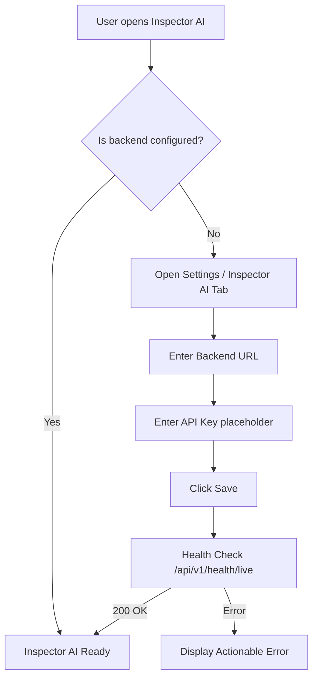

# Inspector AI Backend Configuration

This document outlines the architecture, setup, and troubleshooting for the Inspector AI backend connection. It details how the Chrome Extension communicates with the backend, which configuration values are required, where they come from, and currently missing features in the backend API.

## Architecture

The Inspector AI feature relies on a decoupled architecture:
1.  **Chrome Extension (Frontend):** Provides the AI workspace, chat UI, and configuration panels.
2.  **FastAPI Server (Backend):** Serves as the orchestration layer, connecting to LLM providers (OpenAI, Anthropic, Gemini, etc.), executing Agent workflows, and applying RBAC.

The extension communicates with the backend via REST endpoints. The core configuration is stored in the browser's `localStorage` and sent with every background request.

## Configuration Values

### 1. Backend URL (`sfirBackendUrl`)
- **What it is:** The base URL of the FastAPI server hosting the Inspector AI backend.
- **Is it a FastAPI server?** Yes.
- **Where it comes from:** The developer or administrator deploying the backend. It must be manually entered into the Inspector AI configuration page.
- **Endpoints used:** The extension appends paths like `/api/v1/health/live` (for health checks) and `/api/v1/ai/chat` to this base URL.
- **Examples:**
    - **Development:** `http://localhost:8000`
    - **Production:** `https://api.sfir.dev` or `https://ai.company.com`

### 2. API Key (`sfirBackendApiKey`)
- **What it is:** A token intended to authenticate the Chrome extension with the backend.
- **Current Lifecycle & Validation:**
    - The extension sends this value in the `X-API-Key` HTTP header.
    - **However, the backend currently ignores the `X-API-Key` header.** 
    - The backend's authentication system (via `api/deps.py` and `JWTService`) strictly expects a `Bearer` token inside the `Authorization` header, generated via `POST /api/v1/auth/login`.
    - **API key generation is not yet implemented.** The backend has a `SecurityEventType.API_KEY_CREATED` model defined, but no endpoints currently exist to generate, manage, or validate static API keys.
- **Requirement:** Users must still enter a placeholder value in the UI to enable the extension's logic, but actual API key auth is pending backend implementation.

### 3. Organization ID (`sfirBackendOrgId`)
- **What it is:** The Salesforce Organization ID (e.g., `00Dxx0000000000`).
- **Is manual entry necessary?** No. 
- **Auto-detection:** The Chrome extension can automatically detect the current Org ID by extracting it from the active Salesforce `sid` cookie or the active `sfHost`. 
- **UI Update:** Manual entry has been removed from the configuration UI. The extension will automatically extract and attach the Org ID context to backend requests where required for multi-tenant isolation.

## Configuration Flow

## Missing Backend Features

Based on an audit of the current backend (`/backend/src/sfir_backend`), the following features are supported vs. missing:

- **API key generation:** ❌ Missing (No endpoint to create keys).
- **API key validation:** ❌ Missing (`X-API-Key` header is ignored; only JWT Bearer tokens are validated).
- **User authentication:** ✅ Supported (`POST /api/v1/auth/login` and `/auth/register` exist and return JWTs).
- **Backend registration:** ✅ Supported (`POST /api/v1/auth/register`).
- **Health endpoint:** ✅ Supported (`/api/v1/health/live`, `/ready`, `/status`). *(Note: The extension must target `/health/live` instead of just `/health`)*.
- **Version endpoint:** ❌ Missing (No dedicated `/version` endpoint, though health status might contain it).

## Development Setup

1. Start the FastAPI backend: `make run` or use Docker (`docker-compose up`). The server will run on `http://localhost:8000`.
2. Open Salesforce Inspector Reloaded Options -> "Inspector AI" tab.
3. Enter `http://localhost:8000` as the Backend URL.
4. Enter any string as the API Key (since validation is not yet implemented).
5. Save and verify the Connected status.

## Troubleshooting

- **Backend Unreachable (Network Error / CORS):** Ensure the backend is running. If running locally, ensure CORS middleware is configured to accept requests from the extension's origin.
- **Authentication Failed (401/403):** Currently, the backend expects a JWT. If you receive a 401, it means a route was protected by `get_current_user_id` which expects a Bearer token.
- **Health check returns 404:** Ensure the extension is pointing to `/api/v1/health/live` and not `/api/v1/health`.
